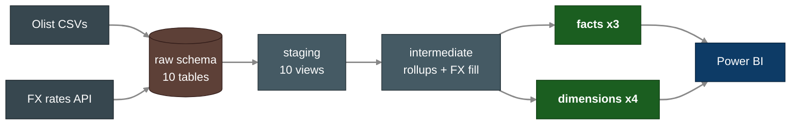
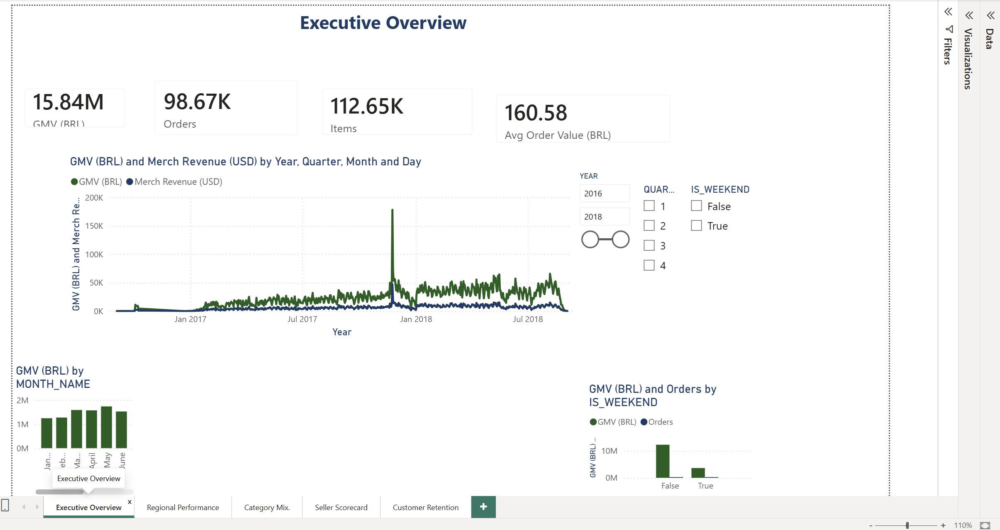
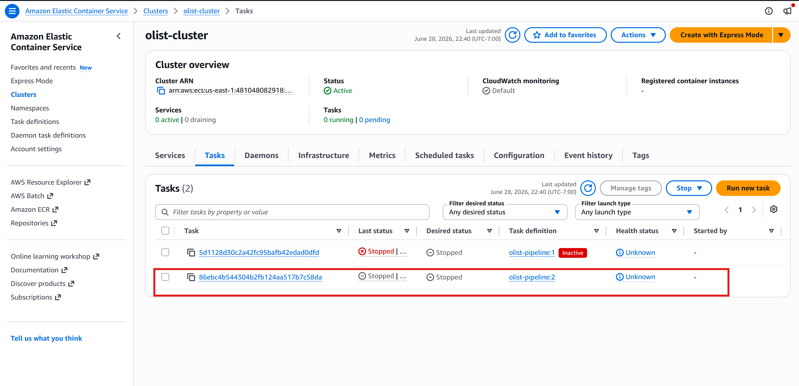
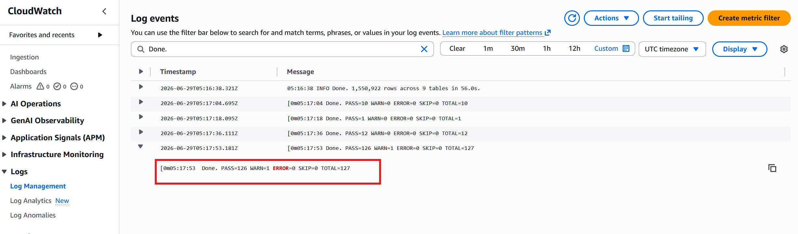
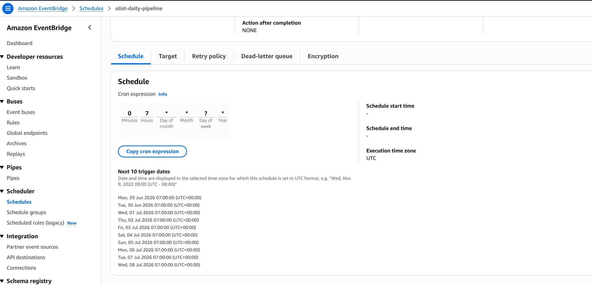
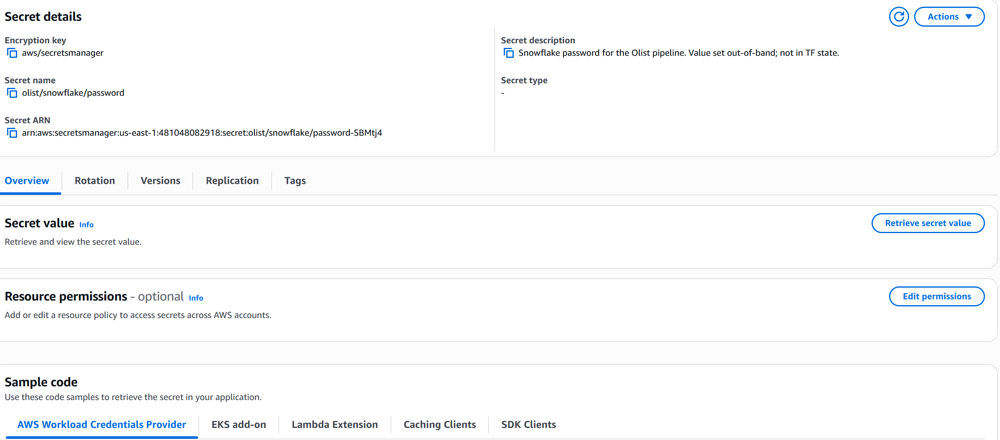

<div align="center">

# Olist E-Commerce Analytics Pipeline

**An end-to-end analytics-engineering pipeline on a real Brazilian e-commerce dataset — Python ingestion → Postgres / Snowflake → a dbt Kimball star schema → BI.**

<br/>

[](https://github.com/Sudeshna-11/olist-ecommerce-analytics-pipeline/actions/workflows/ci.yml)
[](LICENSE)
[](https://www.python.org/)
[](https://www.getdbt.com/)
[](https://www.postgresql.org/)
[](https://www.snowflake.com/)
[](docker-compose.yml)
[](infra/)
[](docs/deployment.md)
[](.github/workflows/ci.yml)
[](docs/ci-cd.md)

</div>

---

## 📖 Project Overview

A working analytics pipeline built on the public [Brazilian Olist dataset](https://www.kaggle.com/datasets/olistbr/brazilian-ecommerce)
(~100K orders across 9 source tables, plus a live FX-rate feed). Raw CSVs are
ingested with Python, landed in a warehouse, and transformed with dbt into a
**Kimball star schema** following **medallion (bronze → silver → gold)** layering.

The same dbt code runs against **two backends** — local Postgres for fast
iteration and Snowflake for production — and the full suite passes **identically
on both: 126 tests green** (one intentional warn on a known data quirk).

<div align="center">



</div>

---

## 🧭 Reading Order

If you're just landing here:

1. **[`docs/business-insights.md`](docs/business-insights.md)** — the "so what":
   how it's built *and* what the data says, in one read.
2. **[`docs/architecture.md`](docs/architecture.md)** — the full system design,
   data flow, two-tier orchestration, and the decision (ADR) log.
3. **[`docs/data-modeling.md`](docs/data-modeling.md)** — why medallion + Kimball,
   the grain of every fact/dim, and what was deliberately rejected.
4. **[`olist_dbt/models/`](olist_dbt/models)** — the SQL itself; each model opens
   with a comment block stating its grain and intent.

---

## 🎯 Project Requirements

| # | Requirement |
|---|-------------|
| 1 | Ingest 9 Olist CSVs + a live FX feed into a warehouse with row-count verification |
| 2 | Run the same transformation code against both Postgres (dev) and Snowflake (prod) |
| 3 | Model a Kimball star schema — facts at their natural grain, conformed dimensions |
| 4 | Track product-attribute history with a Slowly Changing Dimension (Type 2) |
| 5 | Convert native BRL revenue to USD/EUR using historical daily exchange rates |
| 6 | Enforce data quality with tests at every layer (keys, FKs, enums, custom invariants) |
| 7 | Schedule daily refreshes (Airflow) and surface KPIs in a BI dashboard (Power BI) |
| 8 | Run reproducibly in Docker locally and on AWS in production |

---

## 🏗️ Data Architecture

Medallion layering describes how data is refined; Kimball describes how the
business-ready gold tables are shaped. They compose. Full design in
[`docs/data-modeling.md`](docs/data-modeling.md).

| Layer | dbt folder | Schema | Role |
|-------|-----------|--------|------|
| **Bronze** — raw | `models/staging/_sources.yml` | `raw` | 1:1 mirror of the source CSVs, untouched |
| **Silver** — staging | `models/staging/` | `staging` | Rename, cast, light cleaning; 10 views, 1:1 with sources |
| **Silver** — intermediate | `models/intermediate/` | (ephemeral) | Reusable rollups + FX gap-fill; never queried directly |
| **Gold** — marts | `models/marts/` | `marts` | Kimball facts + dimensions, BI-ready |

---

## 🛠️ Tools & Technologies

| Category | Choice | Why |
|----------|--------|-----|
| Local warehouse | PostgreSQL (Docker) | Free, ubiquitous, near-identical SQL to cloud warehouses |
| Cloud warehouse | Snowflake | Most-requested warehouse in current data roles |
| Transformation | dbt-core (`dbt_utils`) | Industry-standard analytics engineering |
| Ingestion | Python 3.10+ (`psycopg`, `write_pandas`) | Backend-dispatched bulk loaders |
| Orchestration | Airflow *(week 5)* | Most-listed orchestrator in job postings |
| Dashboard | Power BI *(week 4)* | Works natively against a star schema |
| Containers | Docker Compose | Reproducible local environment |
| Infra-as-code | Terraform on AWS *(week 6)* | ECS Fargate deployment |
| Quality | dbt tests + Great Expectations *(week 7)* | Data quality is the headline ask |

---

## 📊 Gold Layer — The Star Schema

Three facts at their natural grain, conformed across four dimensions by
surrogate key. Built and tested on both backends.

| Model | Grain | Type / technique | Rows |
|-------|-------|------------------|-----:|
| `fct_orders` | one order | Header fact — delivery SLAs, merchandise + payment rollups | 99,441 |
| `fct_order_items` | one order line | **Incremental** fact — revenue, BRL→USD/EUR, point-in-time product join | 112,650 |
| `fct_order_reviews` | one (review, order) | Review fact — score + response time | 99,224 |
| `dim_customers` | one customer | Type 1, surrogate key, ZIP geo centroid | 99,441 |
| `dim_sellers` | one seller | Type 1, surrogate key, ZIP geo centroid | 3,095 |
| `dim_products` | one product *version* | **SCD Type 2** via dbt snapshot | 32,951 |
| `dim_dates` | one calendar day | Generated with `dbt_utils.date_spine()` | 1,096 |

**Data quality:** 🟩 **126 tests pass** · 🟨 1 intentional warn — identical on
Postgres and Snowflake. Tests span `not_null`, `unique`, `accepted_values`,
`relationships` (FK integrity across the star), `dbt_utils` composite-key
checks, and a custom singular test guarding the SCD2 one-current-version
invariant. The lone warn flags 789 `review_id`s that legitimately span multiple
orders — surfaced, not hidden.

The marts answer questions like:

- Which product categories drive the most revenue, in BRL *and* USD?
- Where are customers and sellers concentrated geographically?
- What's average delivery time versus the estimate, by region?
- Which sellers are top- versus lowest-rated?

---

## 📈 Dashboards (Power BI)

Five executive pages built directly on the gold aggregates over a live Snowflake
Import connection. Full design and the complete DAX set live in
[`dashboards/`](dashboards/README.md).



| Page | Source aggregate | Headline |
|------|------------------|----------|
| Executive Overview | `mart_daily_revenue` | R$15.84M GMV, 98.67K orders, AOV R$160.58 over time |
| Regional Performance | `mart_state_performance` | GMV choropleth + delivery / on-time % by state |
| Category Mix | `mart_category_revenue` | Top 15 of 72 categories drive ~76% of revenue |
| Seller Scorecard | `mart_seller_performance` | 3,095 sellers, revenue vs review rating (churn risk) |
| Customer Retention | `mart_customer_cohorts` | 96,096 unique shoppers, ~3% repeat rate |

---

## 💡 Key Findings

What the warehouse actually reveals (every figure queried live from the gold
marts — see the full write-up in [`docs/business-insights.md`](docs/business-insights.md)):

- **Delivery is the #1 driver of satisfaction.** On-time orders average **4.3★**;
  late ones average **2.6★** and nearly **half get a 1-star review**. Hitting the
  promised date is almost the entire CX story.
- **It's an acquisition business.** Only **3.1%** of customers ever order again
  (measured on the true person key) — the single biggest untapped opportunity.
- **Revenue is concentrated.** São Paulo alone is **37% of GMV** and the **top 3
  states are 62%** — and SP is also the fastest/most reliable to deliver (8.7 vs
  15.5 days), which is exactly why it converts better.
- **Instalments are core.** **51%** of orders are financed — *parcelamento* isn't a
  fringe option, it's how the majority buy.

---

## ⚙️ Quick Start

Prereqs: Docker Desktop, Python 3.10+, Git.

```powershell
# 1. Clone
git clone https://github.com/Sudeshna-11/olist-ecommerce-analytics-pipeline.git
cd olist-ecommerce-analytics-pipeline

# 2. Env templates — non-secret config in .env, credentials in .secrets.env
Copy-Item .env.example .env
Copy-Item .secrets.env.example .secrets.env
# then edit .secrets.env with real passwords / API keys

# 3. Python virtual env
python -m venv .venv
.\.venv\Scripts\Activate.ps1
pip install -r requirements.txt

# 4. Start Postgres in Docker
docker compose up -d

# 5. Download the Olist CSVs into data/raw/  (see data/README.md)

# 6. Load CSVs + FX rates, then verify row counts
python -m src.ingest.load_olist
python -m src.ingest.fx_rates
python -m src.ingest.verify_load
```

After step 6 you'll have 10 tables in the `raw` schema; `verify_load` fails
loudly if any count is off.

---

## 🔧 dbt: dev (Postgres) & prod (Snowflake)

The dbt project lives in [`olist_dbt/`](olist_dbt) and reuses the same
`.env` / `.secrets.env` split through a thin wrapper that calls `load_env()`
before dispatching to dbt:

```powershell
pip install -r requirements-dev.txt     # dbt-core, dbt-postgres, dbt-snowflake

python scripts/dbt.py deps              # install dbt_utils
python scripts/dbt.py build             # run + test every model (dev / Postgres)
python scripts/dbt.py build --target prod   # same code, Snowflake
python scripts/dbt.py docs generate     # catalog + lineage graph
```

Two targets are defined in `olist_dbt/profiles.yml`:

| Target | Backend | Use |
|--------|---------|-----|
| `dev` *(default)* | Local Postgres | Free, fast iteration |
| `prod` | Snowflake | Production-faithful deploy |

Materialization defaults: `staging` = view, `intermediate` = ephemeral,
`marts` = table — with `fct_order_items` incremental and `dim_products` backed
by a dbt snapshot. Config is split so `.env` is shareable while
`.secrets.env` (gitignored, `override=True`) holds the real credentials.

---

## ⛓️ Orchestration (Airflow)

A daily Airflow DAG runs the whole pipeline against **Snowflake prod** so the
Power BI report refreshes nightly. The stack lives in [`airflow/`](airflow/README.md)
— a Docker Compose **LocalExecutor** setup (metadata Postgres + webserver +
scheduler) that mounts the repo and runs the real `src/` and dbt code from an
isolated venv, with failure alerts to Slack.

```
load_olist ─┐
            ├─> verify_load ─> dbt deps ─> dbt run (staging)
fx_rates  ──┘                          ─> dbt snapshot
                                       ─> dbt run (marts) ─> dbt test
```

<!-- Screenshot: save the all-green grid view from http://localhost:8080
     to airflow/screenshots/dag-run.png, then uncomment the line below. -->
<!--  -->

The dbt stage is split around the SCD2 **snapshot**: it reads the staging views
and feeds `dim_products`, so staging is built first, the snapshot is taken, then
the marts are built and tested. Schedule `0 7 * * *`, `catchup=False`, 2 retries
per task, and an `on_failure_callback` that posts to a Slack webhook.

```powershell
cd airflow
docker compose up -d --build        # build image + start the stack
start http://localhost:8080         # UI, admin / admin
```

---

## ☁️ Deployment (Terraform + AWS)

The pipeline is deployed to **AWS ECS Fargate**, defined entirely in Terraform
([`infra/`](infra/README.md)). A single container image (the whole
`ingest → verify → dbt build`) is launched daily by **EventBridge Scheduler** —
Snowflake stays the warehouse, AWS provides the scheduled compute. Airflow remains
the local/dev orchestrator; this is the production trigger. Design rationale and
trade-offs in [`docs/deployment.md`](docs/deployment.md).

```
EventBridge Scheduler  cron(0 7 * * ? *)
        │ ecs:RunTask (FARGATE)
        ▼
ECS Fargate task ──pull── ECR (pipeline image)
   ├─ raw CSVs ──── S3              ├─ password ──── Secrets Manager
   ├─ logs ──────── CloudWatch      └─ transforms ── Snowflake
Terraform state ── S3 + DynamoDB lock   ·   default VPC, no NAT gateway
```

| Concern | Choice |
|---------|--------|
| Compute | ECS Fargate run-to-completion task (no always-on services) |
| Image | Built from [`deploy/Dockerfile`](deploy/), pushed to ECR |
| Schedule | EventBridge Scheduler, `cron(0 7 * * ? *)` UTC |
| Secrets | Snowflake password in Secrets Manager (never in TF state) |
| State | S3 backend + DynamoDB lock (bootstrapped separately) |
| Cost | ~$0–2/mo; `terraform destroy` returns it to $0 |

```powershell
# bootstrap remote state once, then deploy
terraform -chdir=infra/bootstrap init; terraform -chdir=infra/bootstrap apply
cd infra; cp backend.hcl.example backend.hcl   # fill from bootstrap outputs
terraform init -backend-config=backend.hcl
terraform apply                                # build/push image + provision
```

A full cloud run is verified green: **`PASS=126 WARN=1 ERROR=0`** in CloudWatch,
identical to local and Airflow.

<div align="center">






</div>

---

## 🧪 CI/CD & Data Quality

Every push and pull request runs a [GitHub Actions pipeline](.github/workflows/ci.yml)
with three jobs:

| Job | What it does | Needs |
|-----|--------------|-------|
| **Lint & unit tests** | `ruff` lint + the fast unit suite (`pytest -m "not integration"`) | nothing |
| **Pipeline on sample** | Spins an ephemeral Postgres and runs the **whole pipeline**: ingest → FX → row-count verify → **Great Expectations source gate** → `dbt build` (**127 tests**) → integration test | nothing (no secrets) |
| **Build deploy image** | Builds the Fargate `deploy/Dockerfile` so the cloud image can't silently break | nothing |

**No credentials in CI.** The integration job can't use the real Kaggle CSVs
(they're gitignored and need an account to download), so it runs against a small
**referentially-consistent data sample** committed under
[`tests/fixtures/sample_raw/`](tests/fixtures/sample_raw). The sample is carved
as a closed slice of the foreign-key graph (every child row's parent is present),
so it survives the full dbt suite — **127 tests, all green** (the lone review-dup
warn on the full dataset doesn't occur in the sample). Regenerate it with
`python scripts/make_sample.py`.

**Two layers of data tests, by design:**

- **Great Expectations** validates the **raw (bronze) layer** right after
  ingestion — an independent *source contract* (key integrity, value domains like
  `review_score ∈ [1,5]`, `payment_type` in its known set, non-negative prices).
  Bad source data is caught at the door, before any transformation runs.
- **dbt tests** guard the **modelled** staging and gold layers (127 tests:
  not-null, unique, accepted-values, relationships, surrogate-key uniqueness).

Full walkthrough in [`docs/ci-cd.md`](docs/ci-cd.md).

---

## 🚀 Roadmap

| Week | Theme | Deliverable | Status |
|------|-------|-------------|--------|
| 1 | Foundations | Project structure + Docker Postgres + Olist ingestion | ✅ Done |
| 2 | Snowflake + Python | Snowflake backend dispatch + live FX-rate feed | ✅ Done |
| 3 | dbt | Staging → intermediate → gold star schema, tests, docs | ✅ Done |
| 4 | Power BI | Executive / regional / customer dashboards | ✅ Done |
| 5 | Airflow | Daily orchestration DAG + failure alerts | ✅ Done |
| 6 | Terraform + AWS | Deploy to ECS Fargate | ✅ Done |
| 7 | CI/CD + Quality | GitHub Actions + Great Expectations | ✅ Done |
| 8 | Polish | Architecture deep-dive, business write-up, demo script | ✅ Done |

---

## 📂 Repository Structure

```
olist-ecommerce-analytics-pipeline/
├── .github/workflows/       CI: lint + unit, full pipeline on sample, image build
├── data/raw/                Olist CSVs (gitignored — see data/README.md)
├── docs/                    architecture, data-modeling, metrics, ci-cd, business-insights, demo-script, ...
├── src/ingest/              Python ingestion + verification
│   ├── config.py            Dual-file env loader (.env + .secrets.env)
│   ├── load_olist.py        CSV → warehouse orchestrator (TARGET-dispatched)
│   ├── fx_rates.py          Frankfurter API → raw_fx_rates
│   ├── verify_load.py       Post-load row-count check
│   ├── expected.py          Expected raw row counts (sample-aware via env)
│   └── targets/             Per-backend loaders (postgres.py, snowflake.py)
├── olist_dbt/               dbt project
│   ├── models/
│   │   ├── staging/         stg_olist__* views + _sources.yml + _schema.yml
│   │   ├── intermediate/    order rollups, geo centroids, daily FX fill
│   │   └── marts/           fct_* + dim_* star schema
│   │       └── aggregates/  mart_* dashboard-ready rollups (week 4)
│   ├── snapshots/           products_snapshot (SCD2)
│   ├── macros/              convert_brl (FX conversion)
│   ├── tests/               custom singular tests
│   └── profiles.yml         dev=Postgres, prod=Snowflake
├── scripts/                 dbt.py wrapper · ge_validate.py source gate · make_sample.py
├── airflow/                 Daily orchestration DAG (Docker Compose, week 5)
│   ├── dags/                olist_daily_pipeline (ingest → snapshot → dbt)
│   ├── Dockerfile           Airflow image + isolated project venv
│   └── docker-compose.yml   LocalExecutor stack
├── deploy/                  Pipeline container for the cloud (week 6)
│   ├── Dockerfile           Single-image ingest + dbt runtime
│   └── entrypoint.sh        ingest → verify → dbt build, in DAG order
├── infra/                   Terraform — ECS Fargate deployment (week 6)
│   ├── bootstrap/           One-time S3 + DynamoDB remote-state backend
│   ├── ecr.tf s3.tf         Image repo + raw-data bucket
│   ├── ecs.tf iam.tf        Cluster, task definition, task roles
│   ├── secrets.tf           Snowflake password (Secrets Manager)
│   └── schedule.tf          EventBridge daily trigger
├── tests/                   pytest unit + integration tests
│   └── fixtures/sample_raw/ committed FK-consistent data sample for CI
├── docker-compose.yml       Local Postgres
├── requirements.txt         Runtime deps
├── requirements-dev.txt     + pytest, dbt, great-expectations, ruff
└── README.md
```

---

## 📚 Documentation

| Document | What's inside |
|----------|---------------|
| [`docs/data-modeling.md`](docs/data-modeling.md) | Medallion + Kimball design, grain of every fact/dim, rejected alternatives |
| [`docs/architecture.md`](docs/architecture.md) | End-to-end data flow and infrastructure target state |
| [`docs/metrics.md`](docs/metrics.md) | Metric/KPI spec — every measure mapped to its aggregate, currency, and additivity rules |
| [`docs/dashboards.md`](docs/dashboards.md) | Power BI dashboard design — five pages, each visual bound to an aggregate |
| [`docs/powerbi-connection.md`](docs/powerbi-connection.md) | Connect Power BI to Snowflake `ANALYTICS_marts` + the full DAX measure set |
| [`docs/deployment.md`](docs/deployment.md) | AWS deployment design — scheduled Fargate task, secrets, networking, cost/teardown |
| [`docs/ci-cd.md`](docs/ci-cd.md) | GitHub Actions pipeline, the CI data sample, and the Great Expectations source gate |
| [`docs/business-insights.md`](docs/business-insights.md) | Blended build + insights case study — key findings (delivery, retention, concentration) backed by live mart queries |
| [`docs/demo-script.md`](docs/demo-script.md) | Scene-by-scene script for a 6–8 min recorded walkthrough |

---

## 📄 License

Released under the [MIT License](LICENSE).
