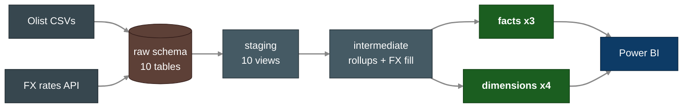

<div align="center">

# Olist E-Commerce Analytics Pipeline

**An end-to-end analytics-engineering pipeline on a real Brazilian e-commerce dataset — Python ingestion → Postgres / Snowflake → a dbt Kimball star schema → BI.**

<br/>

[](LICENSE)
[](https://www.python.org/)
[](https://www.getdbt.com/)
[](https://www.postgresql.org/)
[](https://www.snowflake.com/)
[](docker-compose.yml)

</div>

---

## 📖 Project Overview

A working analytics pipeline built on the public [Brazilian Olist dataset](https://www.kaggle.com/datasets/olistbr/brazilian-ecommerce)
(~100K orders across 9 source tables, plus a live FX-rate feed). Raw CSVs are
ingested with Python, landed in a warehouse, and transformed with dbt into a
**Kimball star schema** following **medallion (bronze → silver → gold)** layering.

The same dbt code runs against **two backends** — local Postgres for fast
iteration and Snowflake for production — and the full suite passes **identically
on both: 126 tests green** (one intentional warn on a known data quirk).

<div align="center">



</div>

---

## 🧭 Reading Order

If you're just landing here:

1. **[`docs/data-modeling.md`](docs/data-modeling.md)** — why medallion + Kimball,
   the grain of every fact/dim, and what was deliberately rejected.
2. **[`docs/architecture.md`](docs/architecture.md)** — how data moves from CSV to
   warehouse to dashboard, and the infrastructure target state.
3. **[`olist_dbt/models/`](olist_dbt/models)** — the SQL itself; each model opens
   with a comment block stating its grain and intent.

---

## 🎯 Project Requirements

| # | Requirement |
|---|-------------|
| 1 | Ingest 9 Olist CSVs + a live FX feed into a warehouse with row-count verification |
| 2 | Run the same transformation code against both Postgres (dev) and Snowflake (prod) |
| 3 | Model a Kimball star schema — facts at their natural grain, conformed dimensions |
| 4 | Track product-attribute history with a Slowly Changing Dimension (Type 2) |
| 5 | Convert native BRL revenue to USD/EUR using historical daily exchange rates |
| 6 | Enforce data quality with tests at every layer (keys, FKs, enums, custom invariants) |
| 7 | Schedule daily refreshes (Airflow) and surface KPIs in a BI dashboard (Power BI) |
| 8 | Run reproducibly in Docker locally and on AWS in production |

---

## 🏗️ Data Architecture

Medallion layering describes how data is refined; Kimball describes how the
business-ready gold tables are shaped. They compose. Full design in
[`docs/data-modeling.md`](docs/data-modeling.md).

| Layer | dbt folder | Schema | Role |
|-------|-----------|--------|------|
| **Bronze** — raw | `models/staging/_sources.yml` | `raw` | 1:1 mirror of the source CSVs, untouched |
| **Silver** — staging | `models/staging/` | `staging` | Rename, cast, light cleaning; 10 views, 1:1 with sources |
| **Silver** — intermediate | `models/intermediate/` | (ephemeral) | Reusable rollups + FX gap-fill; never queried directly |
| **Gold** — marts | `models/marts/` | `marts` | Kimball facts + dimensions, BI-ready |

---

## 🛠️ Tools & Technologies

| Category | Choice | Why |
|----------|--------|-----|
| Local warehouse | PostgreSQL (Docker) | Free, ubiquitous, near-identical SQL to cloud warehouses |
| Cloud warehouse | Snowflake | Most-requested warehouse in current data roles |
| Transformation | dbt-core (`dbt_utils`) | Industry-standard analytics engineering |
| Ingestion | Python 3.10+ (`psycopg`, `write_pandas`) | Backend-dispatched bulk loaders |
| Orchestration | Airflow *(week 5)* | Most-listed orchestrator in job postings |
| Dashboard | Power BI *(week 4)* | Works natively against a star schema |
| Containers | Docker Compose | Reproducible local environment |
| Infra-as-code | Terraform on AWS *(week 6)* | ECS Fargate deployment |
| Quality | dbt tests + Great Expectations *(week 7)* | Data quality is the headline ask |

---

## 📊 Gold Layer — The Star Schema

Three facts at their natural grain, conformed across four dimensions by
surrogate key. Built and tested on both backends.

| Model | Grain | Type / technique | Rows |
|-------|-------|------------------|-----:|
| `fct_orders` | one order | Header fact — delivery SLAs, merchandise + payment rollups | 99,441 |
| `fct_order_items` | one order line | **Incremental** fact — revenue, BRL→USD/EUR, point-in-time product join | 112,650 |
| `fct_order_reviews` | one (review, order) | Review fact — score + response time | 99,224 |
| `dim_customers` | one customer | Type 1, surrogate key, ZIP geo centroid | 99,441 |
| `dim_sellers` | one seller | Type 1, surrogate key, ZIP geo centroid | 3,095 |
| `dim_products` | one product *version* | **SCD Type 2** via dbt snapshot | 32,951 |
| `dim_dates` | one calendar day | Generated with `dbt_utils.date_spine()` | 1,096 |

**Data quality:** 🟩 **126 tests pass** · 🟨 1 intentional warn — identical on
Postgres and Snowflake. Tests span `not_null`, `unique`, `accepted_values`,
`relationships` (FK integrity across the star), `dbt_utils` composite-key
checks, and a custom singular test guarding the SCD2 one-current-version
invariant. The lone warn flags 789 `review_id`s that legitimately span multiple
orders — surfaced, not hidden.

The marts answer questions like:

- Which product categories drive the most revenue, in BRL *and* USD?
- Where are customers and sellers concentrated geographically?
- What's average delivery time versus the estimate, by region?
- Which sellers are top- versus lowest-rated?

---

## ⚙️ Quick Start

Prereqs: Docker Desktop, Python 3.10+, Git.

```powershell
# 1. Clone
git clone https://github.com/Sudeshna-11/olist-ecommerce-analytics-pipeline.git
cd olist-ecommerce-analytics-pipeline

# 2. Env templates — non-secret config in .env, credentials in .secrets.env
Copy-Item .env.example .env
Copy-Item .secrets.env.example .secrets.env
# then edit .secrets.env with real passwords / API keys

# 3. Python virtual env
python -m venv .venv
.\.venv\Scripts\Activate.ps1
pip install -r requirements.txt

# 4. Start Postgres in Docker
docker compose up -d

# 5. Download the Olist CSVs into data/raw/  (see data/README.md)

# 6. Load CSVs + FX rates, then verify row counts
python -m src.ingest.load_olist
python -m src.ingest.fx_rates
python -m src.ingest.verify_load
```

After step 6 you'll have 10 tables in the `raw` schema; `verify_load` fails
loudly if any count is off.

---

## 🔧 dbt: dev (Postgres) & prod (Snowflake)

The dbt project lives in [`olist_dbt/`](olist_dbt) and reuses the same
`.env` / `.secrets.env` split through a thin wrapper that calls `load_env()`
before dispatching to dbt:

```powershell
pip install -r requirements-dev.txt     # dbt-core, dbt-postgres, dbt-snowflake

python scripts/dbt.py deps              # install dbt_utils
python scripts/dbt.py build             # run + test every model (dev / Postgres)
python scripts/dbt.py build --target prod   # same code, Snowflake
python scripts/dbt.py docs generate     # catalog + lineage graph
```

Two targets are defined in `olist_dbt/profiles.yml`:

| Target | Backend | Use |
|--------|---------|-----|
| `dev` *(default)* | Local Postgres | Free, fast iteration |
| `prod` | Snowflake | Production-faithful deploy |

Materialization defaults: `staging` = view, `intermediate` = ephemeral,
`marts` = table — with `fct_order_items` incremental and `dim_products` backed
by a dbt snapshot. Config is split so `.env` is shareable while
`.secrets.env` (gitignored, `override=True`) holds the real credentials.

---

## 🚀 Roadmap

| Week | Theme | Deliverable | Status |
|------|-------|-------------|--------|
| 1 | Foundations | Project structure + Docker Postgres + Olist ingestion | ✅ Done |
| 2 | Snowflake + Python | Snowflake backend dispatch + live FX-rate feed | ✅ Done |
| 3 | dbt | Staging → intermediate → gold star schema, tests, docs | ✅ Done |
| 4 | Power BI | Executive / regional / customer dashboards | ⬜ Next |
| 5 | Airflow | Daily orchestration DAG + failure alerts | ⬜ |
| 6 | Terraform + AWS | Deploy to ECS Fargate | ⬜ |
| 7 | CI/CD + Quality | GitHub Actions + Great Expectations | ⬜ |
| 8 | Polish | Architecture diagram, walkthrough, business write-up | ⬜ |

---

## 📂 Repository Structure

```
olist-ecommerce-analytics-pipeline/
├── data/raw/                Olist CSVs (gitignored — see data/README.md)
├── docs/                    architecture.md, data-modeling.md
├── src/ingest/              Python ingestion + verification
│   ├── config.py            Dual-file env loader (.env + .secrets.env)
│   ├── load_olist.py        CSV → warehouse orchestrator (TARGET-dispatched)
│   ├── fx_rates.py          Frankfurter API → raw_fx_rates
│   ├── verify_load.py       Post-load row-count check
│   └── targets/             Per-backend loaders (postgres.py, snowflake.py)
├── olist_dbt/               dbt project
│   ├── models/
│   │   ├── staging/         stg_olist__* views + _sources.yml + _schema.yml
│   │   ├── intermediate/    order rollups, geo centroids, daily FX fill
│   │   └── marts/           fct_* + dim_* star schema
│   ├── snapshots/           products_snapshot (SCD2)
│   ├── macros/              convert_brl (FX conversion)
│   ├── tests/               custom singular tests
│   └── profiles.yml         dev=Postgres, prod=Snowflake
├── scripts/dbt.py           Wrapper: load_env() then dispatch to dbt
├── tests/                   pytest unit + integration tests
├── docker-compose.yml       Local Postgres
├── requirements.txt         Runtime deps
├── requirements-dev.txt     + pytest, dbt
└── README.md
```

Folders for `airflow/`, `dashboards/`, `terraform/`, and `.github/workflows/`
arrive in their respective weeks.

---

## 📚 Documentation

| Document | What's inside |
|----------|---------------|
| [`docs/data-modeling.md`](docs/data-modeling.md) | Medallion + Kimball design, grain of every fact/dim, rejected alternatives |
| [`docs/architecture.md`](docs/architecture.md) | End-to-end data flow and infrastructure target state |

---

## 📄 License

Released under the [MIT License](LICENSE).
