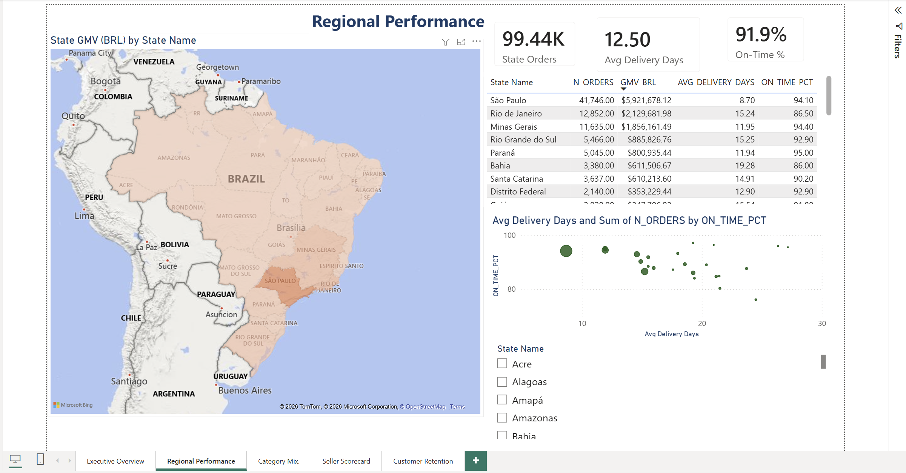
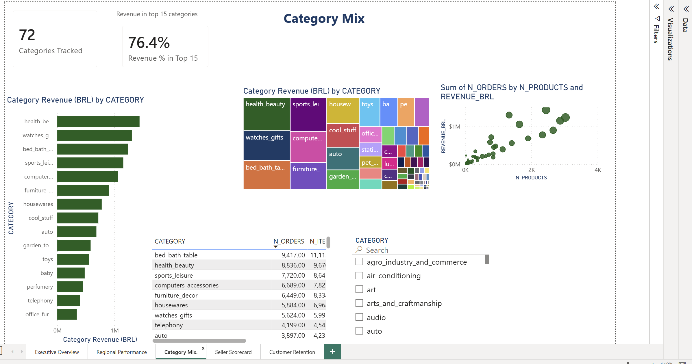
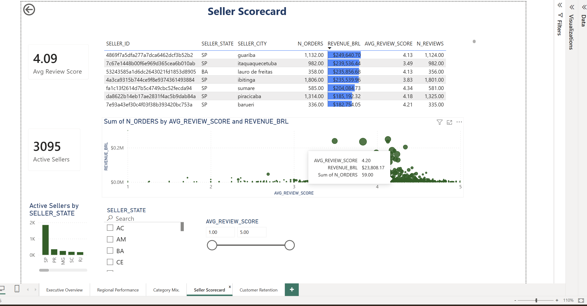
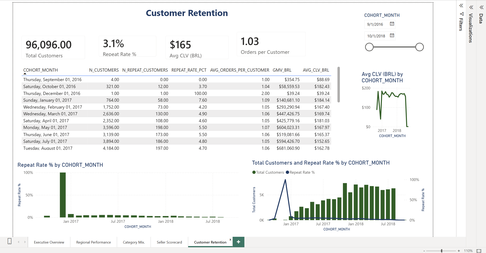

# Dashboards

The Power BI report for the Olist pipeline — five executive pages over the gold
aggregates, connected to **Snowflake `OLIST.ANALYTICS_marts`** in Import mode.

| File | What it is |
|---|---|
| `olist_analytics.pbix` | The Power BI report (5 pages) — open in Power BI Desktop |
| `screenshots/` | PNG exports of each page, embedded below and in the root README |

## Pages

| Page | Source aggregate | Headline |
|---|---|---|
| Executive Overview | `mart_daily_revenue` | GMV trend, orders, AOV over time |
| Regional Performance | `mart_state_performance` | GMV map + delivery / on-time by state |
| Category Mix | `mart_category_revenue` | Revenue by product category |
| Seller Scorecard | `mart_seller_performance` | Revenue vs review rating per seller |
| Customer Retention | `mart_customer_cohorts` | Acquisition cohorts + ~3% repeat rate |

## How it's built

- **Design spec:** [`docs/dashboards.md`](../docs/dashboards.md) — page-by-page visual layout.
- **Connection + DAX:** [`docs/powerbi-connection.md`](../docs/powerbi-connection.md) — how to connect and every measure.
- **Measure definitions:** [`docs/metrics.md`](../docs/metrics.md) — what each number means.

To refresh: open the `.pbix`, **Home → Refresh** (needs Snowflake credentials for
`ANALYTICS_marts`). The aggregates rebuild nightly via dbt; a full refresh is seconds.

## Screenshots

### Executive Overview

### Regional Performance

### Category Mix

### Seller Scorecard

### Customer Retention

