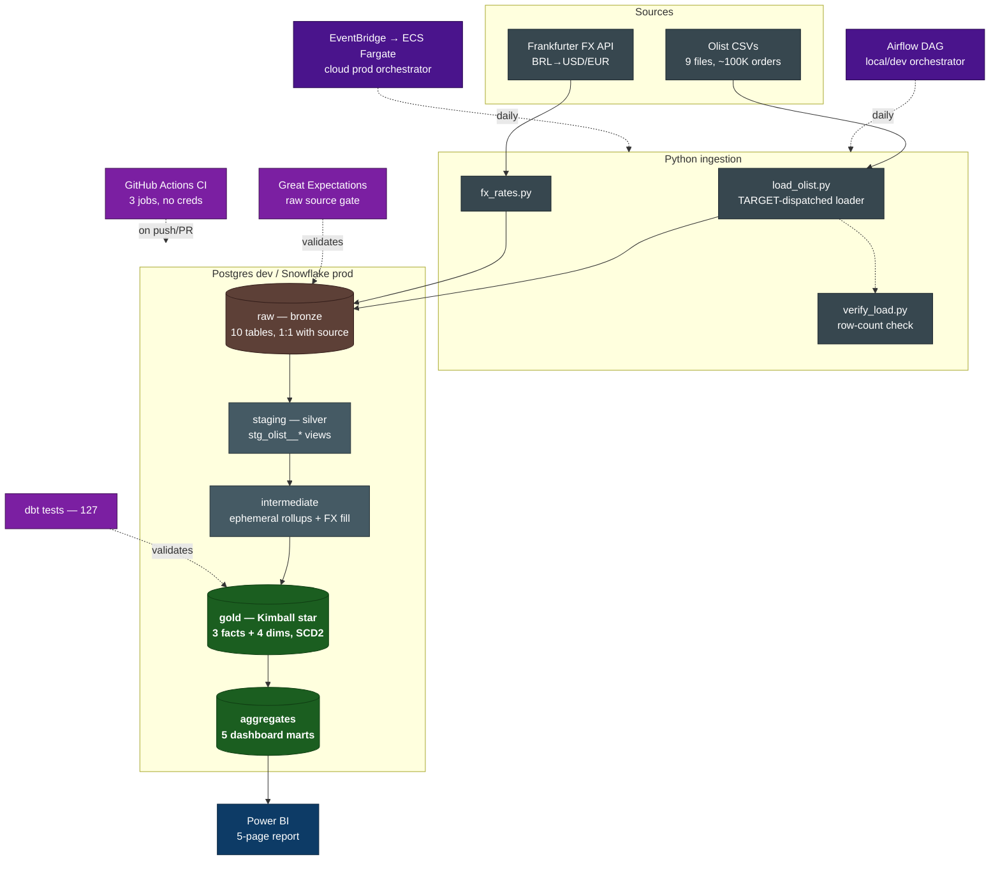

# Architecture

End-to-end design of the Olist analytics pipeline: how raw CSVs become a tested,
query-ready Kimball star schema on Snowflake, orchestrated locally by Airflow and
in the cloud by a scheduled Fargate task, with CI and data-quality gates on every
change. This document is the engineering reference; for the *business* angle and
the findings the warehouse produces, see [business-insights.md](business-insights.md).

## System at a glance

## Data flow, stage by stage

| Stage | What happens | Tech | Where |
|-------|--------------|------|-------|
| **Source** | 9 Olist CSVs (orders, items, payments, reviews, customers, products, sellers, geolocation, category translation) + a live FX feed | Kaggle export · Frankfurter API | `data/raw/` (gitignored) |
| **Ingest** | CSV → 1:1 raw tables; FX fetched for the order date range; post-load row-count verification | Python, pandas, SQLAlchemy | `src/ingest/` |
| **Bronze (`raw`)** | Untransformed landing tables, one per source. Loaded via Postgres `COPY` or Snowflake `write_pandas` | warehouse | `raw` schema |
| **Silver (`staging`)** | Light cleaning, renames, type casts — one view per source (`stg_olist__*`); plus ephemeral intermediate rollups (order/item/payment totals, geo centroids, daily FX forward-fill) | dbt views/ephemeral | `analytics_staging` |
| **Gold (star schema)** | Conformed Kimball model: `fct_orders`, `fct_order_items`, `fct_order_reviews` + `dim_customers/sellers/products/dates`, with SCD2 on products | dbt tables + snapshot | `analytics_marts` |
| **Aggregates** | 5 pre-computed marts (daily revenue, category, state, seller, customer cohorts) sized for BI | dbt tables | `analytics_marts` |
| **BI** | 5-page Power BI report (Executive / Regional / Category / Seller / Retention), Import mode, ratios re-derived in DAX | Power BI | `dashboards/` |

The same dbt code runs against **two backends** — Postgres locally for fast,
free iteration and Snowflake for production — and the full suite passes
identically on both. See [data-modeling.md](data-modeling.md) for the grain of
every fact and dimension and the rejected alternatives.

## Orchestration: two tiers, deliberately

The pipeline has **two** orchestrators, each owning a different job — this is a
design choice, not redundancy (see [ADR-009](#decisions-log-adrs)):

- **Airflow (local/dev)** — a daily DAG (`airflow/dags/`) models the pipeline as
  a task graph: `ingest + fx → verify → dbt deps → run staging → snapshot → run
  marts → test`, with Slack alerts on failure. This is the *development* and
  *demonstration* orchestrator, run via Docker Compose.
- **EventBridge → ECS Fargate (cloud/prod)** — the same containerized pipeline is
  launched once a day by EventBridge Scheduler calling `ecs:RunTask`. No always-on
  scheduler, no idle compute. This is the *production trigger*, provisioned by
  Terraform (`infra/`) and costing ~$0–2/mo.

Both run the **identical** `ingest → verify → dbt build` sequence; only the
trigger differs. The application code needs zero changes between them because
`config.load_env()` and `profiles.yml` read every credential from the
environment, so local `.env` files and ECS secret injection are interchangeable.

## Testing & data quality

Two frameworks, split by layer so each failure points at the right place
([ADR-012](#decisions-log-adrs)):

- **Great Expectations** gates the **raw/bronze** layer immediately after
  ingestion — an independent *source contract* (key integrity, value domains,
  sane ranges). Bad source data is caught before it reaches any transform.
- **dbt tests** (127) own the **modelled** staging and gold layers — not-null,
  unique, accepted-values, relationships, and surrogate-key uniqueness.
- **pytest** covers the Python ingestion (unit + one integration test).

All three run in **GitHub Actions** on every push and PR, against an ephemeral
Postgres loaded with a committed, referentially-consistent data sample — no
credentials required. See [ci-cd.md](ci-cd.md).

## Technology choices

| Layer | Tool | Why this one |
|-------|------|--------------|
| Ingestion | Python + pandas | Simple, testable; per-backend loader modules behind one `TARGET` switch |
| Warehouse | Postgres (dev) / Snowflake (prod) | Free local iteration; cloud-native, separation of storage/compute for prod |
| Transformation | dbt-core | Version-controlled SQL, built-in testing, lineage, SCD2 snapshots; the analytics-engineering standard |
| Orchestration | Airflow (dev) + EventBridge/Fargate (prod) | Airflow for the rich DAG/demo; serverless schedule for cheap prod |
| IaC | Terraform | Reproducible AWS provisioning with remote state |
| BI | Power BI | Most-requested BI tool; Import mode over the pre-built aggregates |
| CI/CD | GitHub Actions | Native to the repo; runs the whole pipeline on a sample |
| Data quality | Great Expectations + dbt tests | Independent source contract + modelled-layer correctness |

These are deliberately the most recruiter-recognizable tools in the current data
market rather than the technically-minimal choice for ~100K rows; the project is
a portfolio piece (see the README's *Project Requirements*).

## Decisions log (ADRs)

| # | Date | Decision | Status |
|---|---|---|---|
| 001 | 2026-05-17 | Use Postgres locally (week 1) before moving to Snowflake (week 2) | Accepted |
| 002 | 2026-05-17 | Use dbt-core (not dbt Cloud) for transformations | Accepted |
| 003 | 2026-05-17 | Airflow for orchestration; alternatives considered: Prefect, Dagster | Accepted |
| 004 | 2026-05-17 | **Medallion layering (bronze/silver/gold) with Kimball star schema at the gold layer.** See [data-modeling.md](data-modeling.md) for the full design. | Accepted |
| 005 | 2026-05-18 | Loader uses a per-backend module under `src/ingest/targets/` (`postgres.py`, `snowflake.py`) selected via the `TARGET` env var. Postgres bulk-loads via `COPY FROM STDIN`; Snowflake via `write_pandas` (internal stage + `COPY INTO`). | Accepted |
| 006 | 2026-05-18 | Configuration split into `.env` (non-secrets) and `.secrets.env` (passwords/API keys, gitignored). `src/ingest/config.py:load_env()` loads both with `override=True` on the secrets pass. Motivation: keep credentials out of any context where `.env` is read or shared (issue reports, chat transcripts). | Accepted |
| 007 | 2026-05-18 | FX rates sourced from api.frankfurter.app (free, no API key, ECB-backed). Fetched for the date range bracketing Olist orders and landed as long-format `raw_fx_rates` (date, base, quote, rate) via the same target-dispatch as Olist CSVs. | Accepted |
| 008 | 2026-06-01 | **dbt project layout for week 3.** Single project at `olist_dbt/` (sibling to `src/`), with `profiles.yml` checked into the repo (not `~/.dbt/`). Two targets: `dev` → Postgres (default, used for iteration), `prod` → Snowflake (deploy + `dbt docs`). Same SQL runs against both; macros via `dbt_utils` only. Credentials sourced from the existing `.env`/`.secrets.env` via a thin `scripts/dbt.py` wrapper that calls `load_env()` before dispatching to `dbt`, so no creds live in `profiles.yml` and no shell sourcing is needed on Windows. Materialization defaults: staging=view, intermediate=ephemeral, marts=table. Naming convention `<layer>_<source>__<entity>` per the official dbt style guide. | Accepted |
| 009 | 2026-06-29 | **Cloud deploy = scheduled ECS Fargate task, not Airflow-on-AWS or MWAA.** The week-5 pipeline runs in the cloud as a single container launched daily by EventBridge Scheduler (`ecs:RunTask`), pulling its image from ECR. Airflow remains the local/dev orchestrator; EventBridge is the production trigger. Rationale: this exercises the full set of resume-relevant AWS primitives (ECR, ECS Fargate, IAM task roles, Secrets Manager, EventBridge, CloudWatch, S3/DynamoDB remote state) at ~$0–2/mo, whereas always-on Airflow-on-Fargate (~$50–150/mo, plus RDS + ALB plumbing) or MWAA (~$350+/mo) cost far more for a portfolio. No application code changed — `load_env()` + `profiles.yml` already read all config from the environment, so ECS env/secret injection suffices. See [deployment.md](deployment.md). | Accepted |
| 010 | 2026-06-29 | **Default VPC + public subnet, no NAT gateway.** The Fargate task runs in the account's default VPC public subnets with a public IP (egress-only security group) to reach Snowflake, ECR, S3, and Secrets Manager. A private-subnet design would need a NAT gateway (~$32/mo), which would dominate the entire bill for a run-to-completion task that takes a few minutes a day. Accepted as a deliberate cost trade-off appropriate to a portfolio workload. | Accepted |
| 011 | 2026-06-29 | **CI runs the full pipeline against a committed data sample, not the real CSVs.** The Olist CSVs are gitignored and need a Kaggle account to download, so CI can't load them. Rather than reduce CI to unit tests only, the integration job runs the entire pipeline (ingest → verify → Great Expectations → `dbt build`) against a small **referentially-consistent sample** committed under `tests/fixtures/sample_raw/` and generated by `scripts/make_sample.py`. The sample is a closed slice of the foreign-key graph (every child row's parents are kept), so all 127 dbt tests pass exactly as on the full dataset; geolocation is capped to a few rows per zip prefix to keep the fixture small. To support this without forking the production code, three env hooks were added: `OLIST_RAW_DIR` (loader source dir), `OLIST_EXPECTED_COUNTS` (row-count manifest for the sample), and `FX_RATES_CSV` (offline FX load, so CI needs no Frankfurter call). CI uses an ephemeral Postgres service and needs **no credentials**. See [ci-cd.md](ci-cd.md). | Accepted |
| 012 | 2026-06-29 | **Great Expectations validates the raw layer; dbt tests own the modelled layers.** The two test frameworks are split by layer rather than overlapped. Great Expectations (`scripts/ge_validate.py`) runs against the raw bronze tables immediately after ingestion as an independent **source-data contract** — key integrity, value domains (`review_score ∈ [1,5]`, `payment_type`/`order_status` in their known sets, non-negative prices/freight, valid lat/lng), and a non-empty-table guard. dbt's 127 tests continue to guard the staging and gold layers. Rationale: catch bad *source* data at ingestion (before it propagates into transforms) while keeping dbt the single owner of *modelled* correctness — no duplicated assertions, and each failure points at the right layer. The gate runs in CI and is runnable locally (`python scripts/ge_validate.py`) against the full warehouse. | Accepted |
